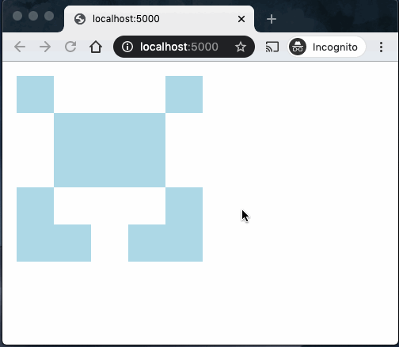

# gh-icon-generator

Generate GitHub-like icons.

## Prerequisites

```sh
pip3 install -r requirements.txt
```

## How to use

### Running script

Random pattern is saved as `icon.svg` by running the following command line.

```sh
python3 generate_patter.py
```

### Using Flask

Flask app will be started by running the following command line.

```sh
FLASK_APP=flask_app.py flask run
```

Access <http://localohost:5000> to see a random pattern. Reload the page to see another one.


